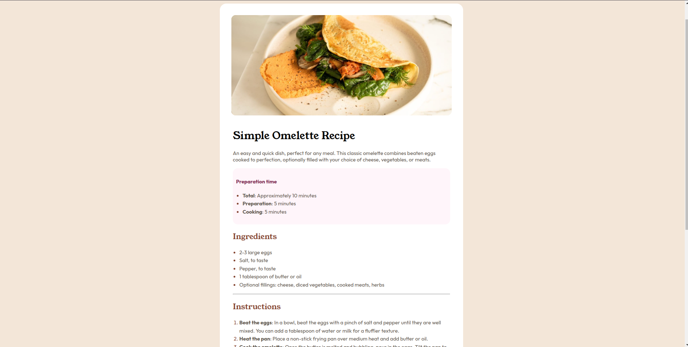

# Frontend Mentor - Recipe page solution

This is a solution to the [Recipe page challenge on Frontend Mentor](https://www.frontendmentor.io/challenges/recipe-page-KiTsR8QQKm). Frontend Mentor challenges help you improve your coding skills by building realistic projects. 

## Table of contents

- [Overview](#overview)
  - [The challenge](#the-challenge)
  - [Screenshot](#screenshot)
  - [Links](#links)
- [My process](#my-process)
  - [Built with](#built-with)
  - [What I learned](#what-i-learned)
  - [Continued development](#continued-development)
  - [Useful resources](#useful-resources)
- [Author](#author)
- [Acknowledgments](#acknowledgments)


## Overview

### Screenshot




### Links

- Solution URL: [Add solution URL here](https://your-solution-url.com)
- Live Site URL: [Add live site URL here](https://abandonedwaffle.github.io/recipe_page/)

## My process

### Built with

- Semantic HTML5 markup
- CSS custom properties
- Flexbox
- Mobile-first workflow

### What I learned

Learned a lot about structuring content using Flex-Conatainer. I think I am getting the hang of FlexBox now. NGL it was troublesome at first as I was having trouble grasping some easy concept. This project helped me understand that. 

To see how you can add code snippets, see below:

```html
<div class="nutrition-container">
      <h2>Nurition</h2>
      <p>The table below shows nutritional values per serving without the additional fillings.</p>
      <table>
          <tr>
              <td class="nutrition_name">Calories</td>
              <td class="nutrition_value">277kcal</td>
          </tr>
          <tr>
            <td class="nutrition_name">Carbs</td>
            <td class="nutrition_value">0g</td>
          </tr>
          <tr>
            <td class="nutrition_name">Protein</td>
            <td class="nutrition_value">20g</td>
          </tr>
          <tr>
            <td class="nutrition_name">Fat</td>
            <td class="nutrition_value">22g</td>
          </tr>
      </table>

    </div>
```
```css
@media all and (max-width: 800px) {
    .main {
        /* padding: 10px; */
        width: 375px;
        height: auto;
    }
    .arcCont {
        padding: 15px;
    }
    img {
        border-radius: 0;
        padding: 0;
        
    }
  
    .main {
        border-radius: 0;
    }
}
```

### Continued development

I think I am still not comfortable with designing layout. I think I should practice more. 

### Useful resources

- [CHAINING CSS SELECTORS](https://deryatanriverdi.medium.com/css-selectors-a1b79c2b4167) - Needed a refresher on CSS SELECTORS. This helped me a lot.


## Author

- Website - [Ritesh Diwan](https://abandonedwaffle.github.io/recipe_page/)
- Frontend Mentor - [@abandonedwaffle](https://www.frontendmentor.io/profile/abandonedwaffle)

## Acknowledgments

Haha. I had to peak a little for arranging Table properly.

